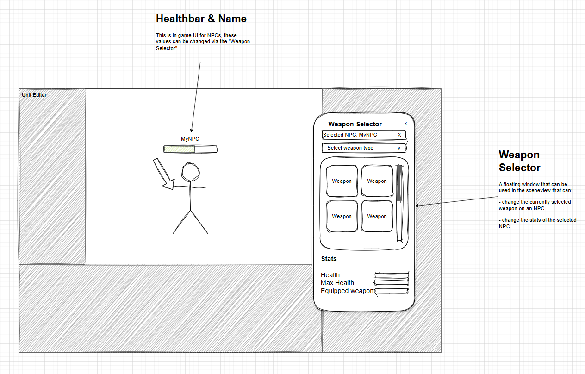
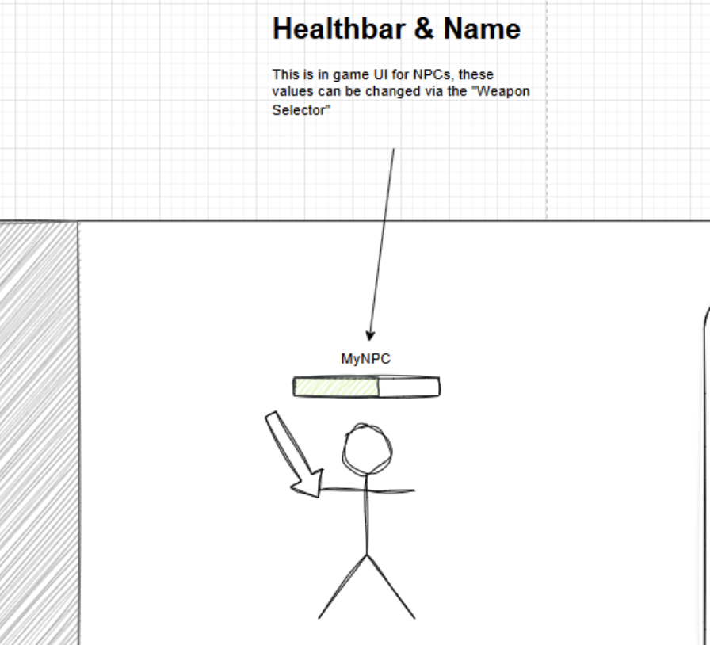
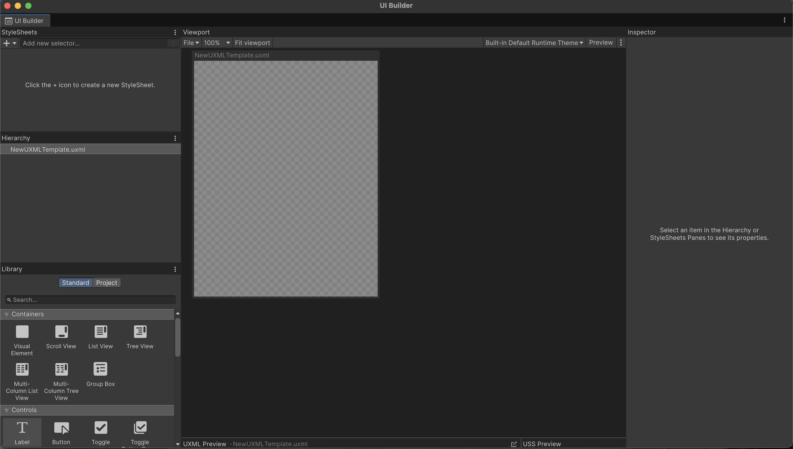
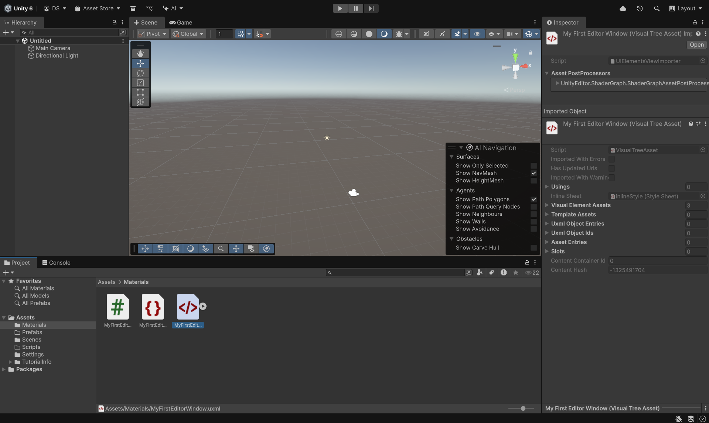
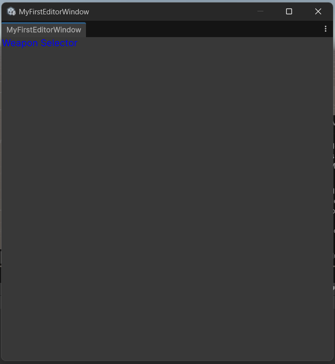
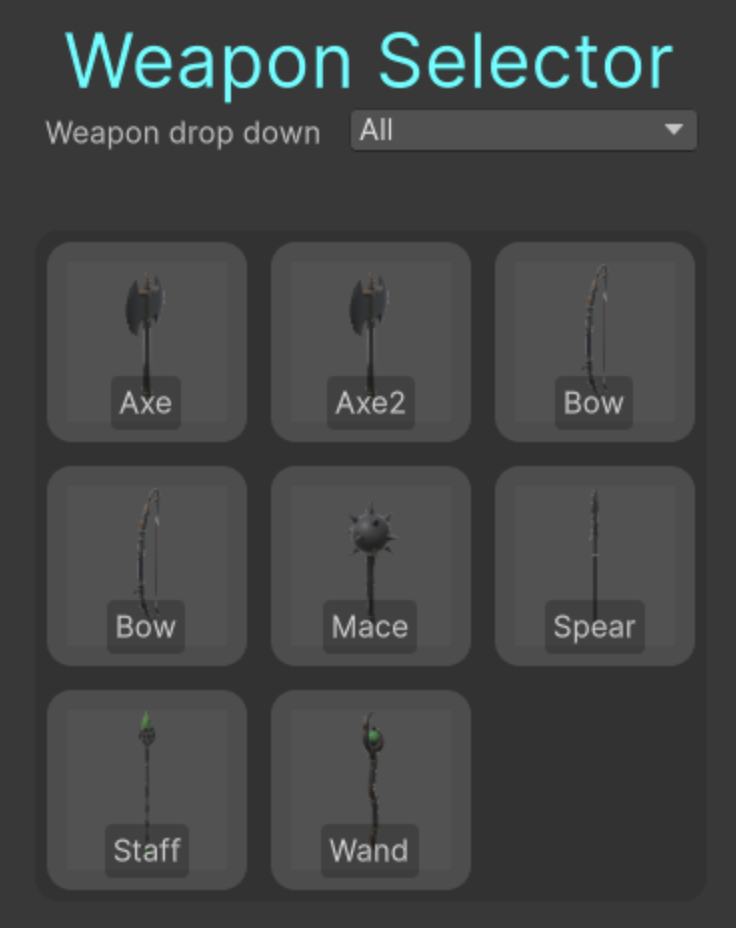
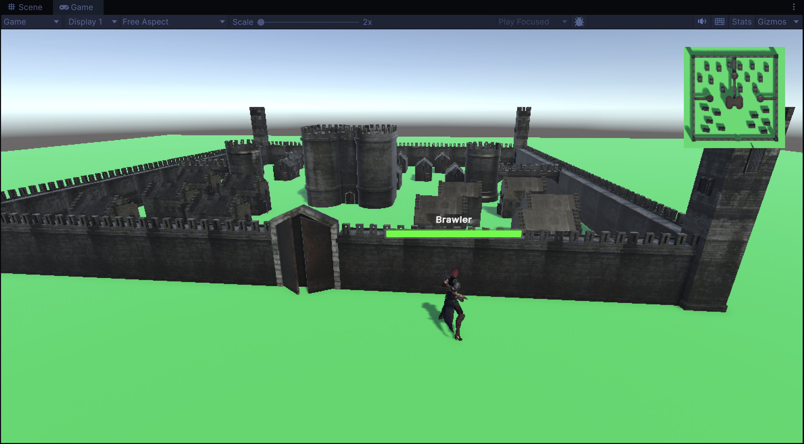

# 🧙‍♂️ Unity Editor UI Workshop

## Each step has a matching solution branch. If you’re stuck, you can move to the branch corresponding with the step to continue working.
> e.g. Stuck on step 5.1? Open the branch `steps/5.1` to see the answer!

## Table of Contents
  - [Introduction](#introduction)
	- [🧑‍💻 Step 1: Clone the GitHub repository to your machine.](#step-1)
    - [🚀 Step 2: Launching the project in Unity Hub.](#step-2)
    - [📊 Step 3 \& 4, Creating a health bar and a name for the NPC.](#-step-3--4-creating-a-health-bar-and-a-name-for-the-npc)
    - [🔫 Step 5: Weapon Selector](#-step-5-weapon-selector)
      - [Step 5.1: Start on the Weapon Selector](#step-51-start-on-the-weapon-selector)
      - [Step 5.2: Selecting NPCs](#step-52-selecting-npcs)
      - [Step 5.3: Create a Dropdown Field](#step-53-create-a-dropdown-field)
      - [Step 5.4: Weapon Grid](#step-54-weapon-grid)
      - [Step 5.5: Changing weapons and Statistics](#step-55-changing-weapons-and-statistics)
    - [🤩 The End](#-the-end)
    - [🗺️ Step 6: Creating a minimap](#️-step-6-creating-a-minimap)


## Introduction

In this workshop, you will design and build (editor) UI in Unity using UI toolkit. You will be making:
- A 'Weapon Selector', editor UI that allows you to change NPC stats and weapons.
- A floating health bar and name above NPCs, this is in-game UI. 



### Learning Goals
- Getting a general understanding of UXML, USS, UI Builder and C# within UI Toolkit.
    - How C# can be used to create dynamic UI elements.
    - How the interaction between UI and the Scene can be made.
- Understanding how editor UI can be useful for level designers.

### The end result
If you followed along with the steps, you should have:
- Your own custom 'Weapon Selector' with the ability to:
    - Select NPCs.
    - Filter, select and equip weapons.
    - Change the health and name of the selected NPC.
- A floating health bar and name above an NPC that are changeable in the inspector.
- (optional) A minimap in the corner of your screen!


## 🔥 Follow along with the steps listed below to create an Editor UI in Unity!

<a id="step-1"></a>
### 🧑‍💻 Step 1: Clone the GitHub repository to your machine.
Using the terminal:
1. Grab the HTTPS link from the repository's main branch.
2. Use the ```git clone [repo-link-here]``` command inside a folder you created for this workshop.

Using GitHub desktop:
1. Click **“Code”** followed by **“Open with GitHub Desktop.”**  
2. Choose a local folder where the repository should be cloned.  
3. Click **“Clone.”**  

Or use your own preferred method. 💅

---
<a id="step-2"></a>
### 🚀 Step 2: Launching the project in Unity Hub.
Opening the project in Unity Hub.
1. Launch Unity Hub.
2. Click *'Add project from disk'* and select the cloned folder.
3. After loading in make sure to load UIToolkitScene before moving on.

---
### 📊 Step 3 & 4, Creating a health bar and a name for the NPC.
Health bar and floating Name Tutorial.



1. Right-Click on your 'Assets' folder, click on 'Create', click on 'UI Toolkit' and finally on UI Document. Open the created file, it should open it automatically in the UI Builder. You will know this has worked if the newly opened page says 'UI Builder' at the top!



2. (Still inside the UI Builder) In the Hierarchy on the left, drag a Visual Element in (which you can find in the Containers section inside the Library, under the Hierarchy) Also drag a label (under controls) in as a child of the Visual Element. Then drag a progressbar (also under controls) in as a child of the Visual Element.
3. Rename 'Label' to 'nameLabel' and 'ProgressBar' to 'healthBar'.
4. Click on the + sign in the Stylesheet section in the top left of your screen to create a new uss (Unity Style Sheet) and give it the same name as the UI Document.
5. Click on the 'Add new selector...' field (under Stylesheet) to add classes, these classes can then be customized so that every progressbar looks the same. You can also add new classes by clicking on a Visual Element in the Hiearchy and then click on 'Add Style Class To List' under the Stylesheet on the right side of your screen in the Inspector.
6. You can now design the health bar and give it name you prefer, you can even design it by opening up the uss-file inside your editor of choice and edit it there. (like CSS)
7. After you're satisfied with your work on the beautiful health bar you have created, right-click in your Assets folder, click on 'Create', click on 'UI Toolkit' and finally on 'Panel Setting Asset', inside the inspector, under 'Render Mode' choose 'World Space'.
8. Now add an empty GameObject to the NPC, right-click on the newly created GameObject and click on 'Add Component', click on UI Document. Now you can add the Panel Settings to the UXML file. Afterwards a new panel will appear, set Size Mode to Dynamic.


9. You will now have a health bar and a name above the NPC, good job! To get some actual logic for the health bar you will need a health bar script, it will reside in the Scripts-folder. (HealthBar.cs)

<a id="step-5"></a>
### 🔫 Step 5: Weapon Selector
In this step, you will create a Weapon Selector that allows you to change the weapon in the NPC's hand directly from the Scene view.
This tool will make it easier for designers to test and adjust configurations during the development phase.


#### Step 5.1: Start on the Weapon Selector

**Useful Unity documentation:** 
- [Labels](https://docs.unity3d.com/6000.2/Documentation/Manual/UIE-uxml-element-Label.html)
- [Get started with UI Builder](https://docs.unity3d.com/6000.2/Documentation/Manual/UIB-getting-started.html)

In this step you will be creating your first Visual Element, a title for the "Weapon Selector". Creating a static label can be done in two ways:
1. Using the UI Builder, which is best for static elements in your UI.
2. Opening the UXML file inside your preferred editor, which allows for more control over each element.

**Method 1: Using the UI Builder**
1. It's time to create an Editor Window! Right-click on your 'Assets' folder, click on 'Create', click on 'UI Toolkit' and finally on 'Editor Window'.
2. Open the generated C# file and change the `[MenuItem(".../...")]` attribute to: "Tools/WeaponSelector". This changes where your custom UI is located.
	
	

3. Open the UI Builder once more by double-clicking on your .UXML-document.

	

4. Using the UI Builder window, navigate to the 'Library' section and search for a label.
5. Drag the Label to the canvas and give it a name, e.g. 'WeaponSelector'.

You can change the properties of this label using the **'Inspector'** window in the UI Builder on the right side of your screen.

**Method 2: Editing through the use of the UXML file**
1. Right-click on your 'Assets' folder, click on 'Create', click on 'UI Toolkit' and finally on 'Editor Window'.
2. Open the generated C# file and change the `[MenuItem(".../...")]` attribute to: "Tools/WeaponSelector". This changes where your custom UI is located.
	
	

3. Open the .UXML file with your preferred editor. (You can do so by clicking on the arrow of the UXML file, a stylesheet file will pop out and once double-clicked, it will open the actual UXML-file)
4. Add the following: `<ui:Label class="my-title" text="Weapon Selector" />`
5. Open the .USS file with your preferred editor.
	- Add your own styling within the .USS file, e.g.: `.my-title { font-size: 15px; color: blue; }`

Your end result should look something like this:



#### Step 5.2: Selecting NPCs

Requirements: NPCHelper.cs

The field itself is created and managed by the helper class NPCHelper, which keeps your editor code clean and modular.

1. Open MainEditor.cs and locate the CreateGUI() method
2. Inside this method, initialize the npcHelper class and add the following code:

```c#
ObjectField npcField = npcHelper.NPCObjField();
        npcField.RegisterValueChangedCallback(evt =>
        {
            selectedNPC = evt.newValue as NPC;

            RefreshFields();
        });
        weaponSelectorContainer.Add(npcField);
```

3. When you open your Editor Window in Unity (click on Tools at the top of your screen then on MainEditor) you’ll now see a field labeled 'Select NPC' at the top.
4. Drag and drop or choose an NPC GameObject from your scene into this field. (If you want more NPCs you can look inside the prefab folder, our NPC resides inside RFA -> URP -> Prefabs)


#### Step 5.3: Create a Dropdown Field

This step explains how to use a **DropdownField** in UI Toolkit and make it filter through a list of weapons in your custom Unity Editor Window.
> note: You should already have a DropdownField in your UI, you only need to add functionality to it.

1. **Reference the Dropdown in Code** 
   - Inside the `CreateGUI()` method in the MainEditor.cs file, get your dropdown from the UXML:
     ([if you're curious about the Q method](https://docs.unity3d.com/2020.1/Documentation/ScriptReference/UIElements.UQueryExtensions.Q.html))
     ```csharp
     typeDropdown = visualTree.Q<DropdownField>("WeaponDropDown");
     ```

2. **Assign Choices to the Dropdown**
   - Use `typeDropdown.choices` to add a new list of weapon types:
     ```csharp
     typeDropdown.choices = new List<string> { "All", "Melee", "Ranged", "Magic" };
     ```
   - Set the first value to `"All"` so that all weapons are shown when the editor window first opens:
     ```csharp
     typeDropdown.value = "All";
     ```

3. **Register the Value Change Event**
   - To refresh your editor window when the selection changes, use:
     ```csharp
     typeDropdown.RegisterValueChangedCallback(evt =>
     {
         grid.Clear();
         VisualElement updatedGrid = Wg.FillWeaponGrid(allWeapons, typeDropdown);
         grid.Add(updatedGrid);
     });
     ```

4. **Render the Initial Grid**
   - When the editor window opens, build the grid once so that all weapons are shown:
     ```csharp
     grid.Clear();
     grid.Add(Wg.FillWeaponGrid(allWeapons, typeDropdown));
     ```

5. **Filter Weapons by Dropdown Value**
   - In your `FilterWeaponType()` method (which resides in the WeaponGrid file), reference the dropdown’s value and check if it’s not `"All"`.
   - You can use a lambda function that selects only the weapons that match the dropdown value:
     ```csharp
     if (selectedWeaponType.value != "All")
         filteredWeapons = weapons.FindAll(w => w.weaponType.ToString() == selectedWeaponType.value);
     ```

6. **Test the Dropdown**
    - When you open your editor window:
      - `"All"` should be selected by default.
      - There should be options for selecting `"Melee"`, `"Ranged"`, or `"Magic"`.
     
You should now have a dropdown with options for:  `"Melee"`, `"Ranged"`, or `"Magic"`. Displaying and integration with the grid will be done in the next step.


#### Step 5.4: Weapon Grid

The weapon grid displays all the weapons an NPC can equip.

It currently lacks:
1. The ability to load weapons into the grid (use the given WeaponLoader script)
2. Styling (use the .USS file)
3. Ability to select/equip a weapon

**Pseudo code overview**

```C#
//WeaponGrid.cs

public class WeaponGrid {

	VisualElement GridMaker() {
		VisualElement gridContainer = new VisualElement();

		for (row < maxRows) {
			VisualElement rowContainer = new VisualElement();

			for (column < maxColumns) {
				VisualElement item = new VisualElement();

			    item.OnClick(() => {
			 		//this is an OnClick event for each item
		   			//add logic here for selecting/equipping a weapon
				})
				rowContainer.Add(item)
			}
			gridContainer.Add(rowContainer)
		}
		return gridContainer
	}
}
```

#### Loading weapons
- To load weapons you first need to create a `List<>` of the Weapon Scriptable Object (given to you). You can store this list inside the main script.
  Example:
  ```C#
  List<Weapon> = new List<Weapon>();
  ```

- Now use the `LoadAllWeapons()` function from the WeaponLoaderManager class to get all the weapons and add them to the list.
- Using parameters, pass the list to the `FillWeaponGrid()` function and have each item in the grid contain an image and the name of the weapon.
  > Note: images can be loaded using the `loadImageForWeapon()` function
- To add text and images to a VisualElement, you can create a new VisualElement in your C# script and then add the VisualElement to another using the `VisualElement.Add(VisualElement)`.

You should now have a weapon grid that dynamically loads weapons.

#### Styling
WeaponGrid.cs:
- For each VisualElement that is created, use the AddToClassList("my-class") function to add a class to the VisualElement. e.g.: `grid-container`, `grid-row`, and `grid-item`.

USS file:
- To style the grid, create and add 3 classes to the .USS file; `.grid-container`, `.grid-row`, and `.grid-item`.
- Give each class a different `background-color` to differentiate between each VisualElement in the UI.
- Give each class a fitting `margin` property.
- Use the CSS selectors to style the image within the items, e.g.:

  ```CSS
  .grid-item > .unity-image {
      <!-- this will style the image within every .grid-item -->
  }
  ```
- Give the image within an item the property: `position: absolute;` and other appropriate size properties.

#### Selecting and equipping a weapon

To equip a weapon on an NPC, you need to pass the Weapon Scriptable Object to the NPC script. 

1. Within the NPCHelper.cs, create a function called: `EquipWeapon()`.
2. The `EquipWeapon()` method should call the following functions on the selected npc:
	- SetWeaponPrefab() (from NPC.cs)
	- RefreshWeapon() (from NPC.cs)

You should now be able to equip a weapon on an NPC.

#### The end result

Your weapongrid is now finished and should look like this:



#### Step 5.5: Changing weapons and Statistics
Links for step 5.5:
- [Math.Clamp](https://docs.unity3d.com/2020.1/Documentation/ScriptReference/Mathf.Clamp.html)
- [Math.Max](https://docs.unity3d.com/2020.1/Documentation/ScriptReference/Mathf.Max.html)

**Requirements: NPC class, RefreshFields and RefreshHealthBarAndScene methods**

1. Go to MainEditor.cs and add a new VisuelElement to the CreateGUI method (e.g. NPCEditorContainer)
2. Now you can start creating the fields for all attributes, this works exactly the same as in step 5.4, so just try it out for yourself!
3. Don't forget that nameField, healthField and maxHealthField are not ObjectFields
4. Use Mathf.Max for the healthField and Mathf.Clamp for the maxHealthField
5. After initializing healthField, add 'healthField.isDelayed = false;' (this makes it work better).
6. Add healthField.SetValueWithoutNotify(selectedNPC.Health); to the end of the maxHealthField
7. Add the container to root
8. To change weapons, create a new method called 'EquipWeapon' in NPCHelper.cs (use the functions of NPC.cs)
9.  Now open WeaponGrid.cs and modify the method 'GenerateItemElement',  try calling the newly created method when an item is clicked

🚀 You should now be able to change the weapons and stats for the NPC!

### 🤩 The End

**Finished Product:**


Congratulations, you've completed the tutorial!
By now you learned how to use Unity's UI Toolkit to build both in-game and editor UI elements.
You've explored how the Editor UI can interact with objects in the Scene, and you've written a C# script for UI Toolkit.

### At this point you should have:

- A Health Bar and Floating Name displayed above your NPC which appears in-game and are changeable through the inspector.
- A functional Weapon Selector built with the Editor UI that filters weapons based on weapon type.

### 🤓 If you got to this step before the time ran out, then here's an extra challenge for you!

#### 🗺️ Step 6: Creating a minimap
##### This part of the tutorial is completely optional, only in here for fun, and it not using the UI Toolkit system, instead it's using the regular Unity UI.

1. First we need a new camera which will act as our vocal point of the minimap, as it will soar in the sky, so go ahead and right click in the Hierarchy and click on 'Camera', make sure to reset the transform property on the camera.
2. Change the transform property of the camera so it's in the sky! 
- Recommended: 
	- 25 on the Y-axis.
	- 1.5 on the z-axis. (so it's centered more clearly)
	- 90 on the rotation of the X-axis, so it's looking down.
3. Change the projection from perspective to orthographic in the camera Inspector, this removes all perspective from the scene, it looks more flat this way.
4. You can tweak the size value to your liking, this will change how much of the map you will see at a given moment.
5. You can also go ahead and remove the audio listener component from the camera since it's not needed

We wanna make sure we render the minimap as part of our UI, right now it's on top of everything.

6. In the hierarchy, create a new object, right-click and select UI -> raw image  
7. Now you switch to 2d mode (from the scene view, it's in the bar at the top) and click on 'f' to focus on the image.  
8. Zoom out a bit and then drag and drop the image into a corner of your choosing, in the inspector, under rect transform you can anchor it to a corner (top right for example)and then use the Pos X and Pos Y to offset the image. If you now go back to your game scene you can see the image overlayed in your game view.  
9. In the project files, right-click and click on 'Create' -> 'Rendering' -> 'Render Texture', this is what's used to display the camera.  
10. You can change the size of the newly created texture to the same size as the raw image, and set 'Depth Stencil Format' to 'None'.  
11. If you now click on the (new) camera and go to 'Output' in the inspector, you see there's an option for Output Texture, drag the newly created Render Texture in here. Now all the data from the camera is being fed into the Render Texture.  
12. You may have already guessed it, but now we can insert the Render Texture (with the data of the camera) into the Raw Image! So go ahead and click on the Raw Image and drag the Render Texture into it in the inspector.


**Your final product might look similar to this:**

